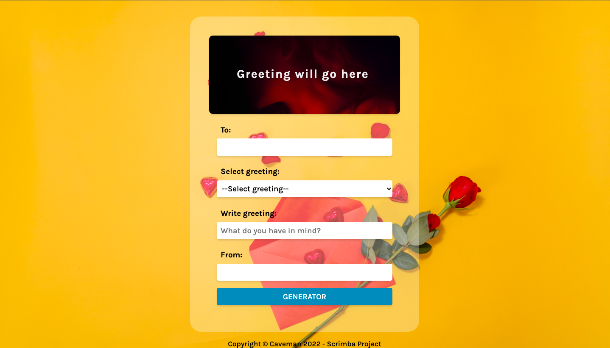

# Card Creator

#### Single-page application, implementing JavaScript Document Object Model manipulation

. User can create a greeting card based on user's input
. To & from inputs are optional
. Custom greeting takes priority over selected greeting

